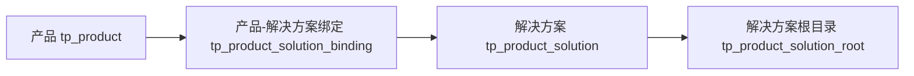

# 产品虚拟组合与解决方案复用设计

## 背景

当前系统把产品与源码目录强绑定：

- `tp_product` 绑定 `project_id`
- `tp_product_solution` 归属于 `product_id`

这会导致共享源码目录场景出现冗余。典型场景是两个产品共用同一套 API 服务代码，但当前结构要求在每个产品下都复制一份 API 项目目录，既增加维护成本，也放大 build 与打包的出错概率。

## 目标

- 让产品成为业务层的虚拟组合，不再直接拥有源码目录。
- 让解决方案成为可复用的实体代码单元，可被多个产品引用。
- 支持一个产品默认关联多个解决方案，并在 build 时自动带上全部启用解决方案。
- 保持现有账号权限、产品选择、构建中心等能力可平滑迁移。
- 落地前必须先完成项目与正式数据库备份，确保可回滚。

## 方案选择

### 方案一：继续保留产品绑定目录，只扩展多目录

- 优点：改动小。
- 缺点：产品仍然是源码目录拥有者，无法真正解决共享 API 等复用问题。

### 方案二：产品虚拟化，解决方案实体化，产品与解决方案改为多对多

- 优点：最符合真实业务结构，支持共享源码目录、统一 build、统一配置。
- 缺点：需要做一次数据模型升级和 build 主链改造。

### 方案三：取消产品层，直接选择解决方案

- 优点：模型最纯粹。
- 缺点：与现有“用户先选产品”的业务流程冲突，管理端与计划中心也会失去统一入口。

### 结论

采用方案二。

## 核心模型

### 1. 产品 `tp_product`

- 保留产品作为业务选择入口。
- `project_id` 不再表示“产品源码目录”，而是“默认上下文项目”。
- 初期保留该字段，避免一次性改动账号权限、上下文选择、产品列表等现有链路。

### 2. 解决方案 `tp_product_solution`

- 变为独立的解决方案库实体，不再从属于单个产品。
- 每个解决方案维护自己的：
  - `name`
  - `code`
  - `enabled`
  - `primary_project_id`
  - `build_profile_json`

### 3. 解决方案根目录 `tp_product_solution_root`

- 继续记录解决方案绑定的源码目录。
- 支持：
  - `single_repo`
  - `parent_batch`
  - `virtual_group`
- 新增 `mount_name` 字段，用于统一多根目录沙盒中的挂载目录名，避免同名目录冲突。

### 4. 绑定关系 `tp_product_solution_binding`

- 新增独立关系表表达“产品关联了哪些解决方案”。
- 字段至少包含：
  - `id`
  - `product_id`
  - `solution_id`
  - `enabled`
  - `sort_order`
  - `time_created`
  - `time_updated`

## 业务规则

- 用户选择产品后，系统自动加载该产品下全部启用解决方案。
- build 默认带上全部启用解决方案，不要求用户二次勾选。
- 一个解决方案可以被多个产品复用。
- 同一个真实目录不再通过复制方式挂到多个产品下，而是通过多个产品引用同一个解决方案实现复用。

## 典型场景

目录层只保留：

- `A/`
- `B/`
- `API/`

解决方案层：

- `solution_a_web` -> `A/`
- `solution_b_web` -> `B/`
- `solution_shared_api` -> `API/`

产品绑定层：

- `产品A` -> `solution_a_web` + `solution_shared_api`
- `产品B` -> `solution_b_web` + `solution_shared_api`

## Build 执行模型

当前 build 仍偏向“单 solution 一次 job”，不适合产品级多解决方案统一改码场景。新的执行模型需要拆成两层。

### 1. 产品级运行

一次用户发起 build，对应一次产品级运行记录。

产品级运行负责：

- 记录 `product_id`
- 记录提示词
- 记录统一的计划内容
- 记录统一的 session
- 记录统一的聚合 workspace

### 2. 解决方案级执行

产品级运行下挂多个解决方案执行记录。

解决方案级执行负责：

- 记录 `solution_id`
- 编译状态
- 打包状态
- 产物信息

### 3. 执行流程

1. 用户选择产品并输入需求。
2. 系统加载该产品全部启用解决方案。
3. 创建一次产品级运行。
4. 聚合全部解决方案 roots，生成统一多根目录沙盒。
5. AI 在同一个 session 中完成跨目录改码。
6. 按解决方案分别执行编译。
7. 按解决方案分别执行打包。
8. 一个产品级运行输出多个产物包。

### 4. 设计原因

- `plan` 与 `coding` 天然是产品级行为。
- `compile` 与 `package` 天然是解决方案级行为。
- 这样既能支持一次需求同时修改前端与共享 API，又能保持每个解决方案的编译打包独立。

## 页面设计

### 1. 产品组合管理

- 左侧：产品列表
- 右侧上半：当前产品信息
- 右侧下半：当前产品绑定的解决方案列表

该页面只负责：

- 绑定解决方案
- 解绑解决方案
- 调整顺序
- 启停绑定关系

产品页不再直接维护源码目录明细。

### 2. 解决方案库

- 左侧：解决方案列表
- 右侧：解决方案详情

该页面负责维护：

- 基础信息
- roots
- `mount_name`
- `build_profile`
- 被哪些产品引用

### 3. 用户侧 build 展示

- 用户仍然只选产品。
- 页面展示只读摘要，说明本次将自动携带哪些解决方案。
- 后续如有需要，再增加“临时取消某个解决方案”的高级选项。

### 4. 构建中心展示

构建中心应从“单 solution job”视角调整为“产品级运行 + 解决方案执行结果”视角，至少展示：

- 产品
- 解析到的解决方案数量
- 解决方案摘要
- 计划内容
- 运行状态
- 每个解决方案的编译与打包状态
- 多个产物下载

## 数据迁移策略

采用兼容迁移，不一次性移除旧字段。

### 阶段 A：新增能力

- 新增 `tp_product_solution_binding`
- 给 `tp_product_solution_root` 新增 `mount_name`
- 旧表与旧字段暂不删除

### 阶段 B：回填绑定关系

- 为当前每条产品下已有解决方案生成一条绑定关系
- 保证旧数据迁移后依然可用

### 阶段 C：语义切换

- 代码层将 `tp_product.project_id` 的语义改成“默认上下文项目”
- build 主链不再通过产品直接取源码目录，而是通过产品绑定的解决方案聚合 roots

### 阶段 D：共享解决方案整理

- 迁移不自动合并重复解决方案
- 管理员在后台把多个产品绑定到同一个共享解决方案
- 再逐步删除冗余解决方案

## 风险控制与回滚

### 项目备份

- 使用 git 创建备份分支
- 使用 git 创建备份 tag
- 如有未提交改动，额外导出 patch

### 数据库备份

- 对正式库执行完整 `pg_dump -Fc`
- 额外导出 schema SQL
- 预先准备恢复命令

### 落地原则

- 先加新表和新链路，不先删旧字段
- 先让旧数据自动兼容
- 先在正式库备份后再执行 migration

## 验证标准

- 产品 A 与产品 B 可同时引用同一个共享 API 解决方案。
- 不再需要复制 API 项目目录。
- 用户选择产品后，build 默认自动带上该产品全部启用解决方案。
- AI 可在一次 session 中同时修改多个解决方案对应目录。
- 编译与打包按解决方案分别执行并产出多个包。
- 管理端可清晰维护“产品组合”和“解决方案库”。
