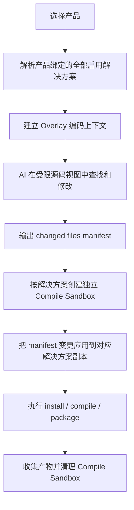

# Overlay Coding + 独立 Compile Sandbox 技术设计

## 1. 背景

当前 TpCode 的 build 闭环采用“产品级聚合沙盒 + 完整 Git worktree”模式：

- 用户选择产品后，默认带上该产品绑定的全部启用解决方案。
- 每个解决方案 root 都会创建完整 worktree，并挂载到批量沙盒中。
- AI 在这个完整沙盒里查找代码、修改代码、执行工具。
- 编译和打包也基于这个完整沙盒继续执行。

这套方式已经能跑通闭环，但存在几个核心问题：

1. 磁盘占用高  
   一个产品带多个解决方案时，沙盒会展开多个完整工作副本。即使 Git 对象库共享，工作区文件、编译中间产物、依赖目录仍会持续放大磁盘占用。

2. 编码与编译耦合太紧  
   AI 改码必须依赖完整 worktree；编译又复用同一沙盒，导致生命周期长、清理复杂、失败排查困难。

3. 并发隔离成本高  
   多个 job 同时改同一个解决方案虽然不会直接污染源目录，但每个 job 都会持有一份完整解决方案工作副本，资源成本过高。

4. 用户感知与实际写入位置不一致  
   用户更关心“改了哪些文件”，当前却只能看到一个包含所有解决方案文件的完整沙盒目录，理解成本高。

因此需要把当前模式升级成：

- `Coding` 阶段：只在覆盖层保存修改文件。
- `Compile` 阶段：为每个解决方案创建独立编译沙盒，再把修改文件应用进去编译。
- 源码搜索范围严格限制在本次参与的解决方案路径内。

## 2. 目标

本设计要实现以下目标：

1. AI 查找代码时，只允许访问本次产品绑定且启用的解决方案路径。
2. AI 改码时，不再为每个解决方案创建完整 worktree；只保存变更文件、删除标记和新增文件。
3. 编译时按解决方案创建独立 compile sandbox，并把变更应用进去后再执行编译和打包。
4. 保持当前“同一产品默认带上全部启用解决方案”的业务规则。
5. 保持并发安全，避免多个 job 修改同一解决方案时互相污染。
6. 保持 Windows 正式环境可用，不引入依赖于 Unix 特性的实现。

## 3. 非目标

本阶段不做以下内容：

1. 不把修改自动合并回原始源码目录。
2. 不做自动 merge 回主分支。
3. 不把任意 `bash` 行为完全虚拟化为覆盖层文件系统。
4. 不改动产品与解决方案的业务模型；本设计只处理 build 执行链和沙盒策略。

## 4. 方案对比

### 方案 A：继续使用完整 worktree，只增加清理

优点：

- 改动最小。
- 现有工具链几乎不用动。

缺点：

- 仍然会展开完整解决方案文件。
- 不能满足“只保存修改文件”的目标。
- 磁盘压力只能缓解，不能根治。

### 方案 B：Overlay Coding + 独立 Compile Sandbox

优点：

- 编码阶段只保留变更集，磁盘占用显著下降。
- 编译阶段仍有完整目录上下文，兼容现有编译命令。
- 并发安全边界清晰。

缺点：

- 需要改造工具层路径解析和写入行为。
- 需要新增 overlay 元数据与 compile sandbox 应用流程。

### 方案 C：Sparse Checkout + 完整 worktree

优点：

- 比完整 worktree 更轻。

缺点：

- AI 改码前很难准确知道需要哪些目录。
- 对多技术栈、多层级引用项目不稳定。
- Windows 下 Git sparse-checkout 行为和团队现有流程磨合成本高。

### 结论

推荐采用 **方案 B：Overlay Coding + 独立 Compile Sandbox**。

## 5. 总体架构

新架构分成两个阶段：

1. `Overlay Coding`
2. `Compile Sandbox`

整体流程如下：



## 6. 核心概念

### 6.1 Source View

`Source View` 是编码阶段对 AI 可见的源码视图，只包含本次参与的解决方案挂载路径。

特点：

- 每个 root 都有稳定的 `mount_name`。
- 只允许访问这些挂载路径。
- 读取优先级为：`overlay 文件 > 原始源码文件`。

### 6.2 Overlay Store

`Overlay Store` 是编码阶段的覆盖层存储，只保存本次 job 的变更。

它包含：

- 新增文件
- 修改后的完整文件内容
- 删除标记
- 变更元数据

不包含：

- 未改动文件
- 完整解决方案副本

建议目录结构：

```text
<job_overlay_root>/
  mounts/
    <solution_code>/
      <mount_name>/
        ...changed files...
  manifest.json
```

### 6.3 Changed Files Manifest

`Changed Files Manifest` 是本次改码结果的唯一可信来源。

建议字段：

- `job_id`
- `solution_id`
- `mount_name`
- `relative_path`
- `change_type`：`create | update | delete`
- `content_hash`
- `size`
- `source_root_directory`
- `overlay_file_path`

Manifest 是：

- Coding 阶段成功判定依据
- Compile 阶段应用变更依据
- 前端展示“修改了哪些文件”的依据

### 6.4 Compile Sandbox

`Compile Sandbox` 是按解决方案创建的独立编译工作区。

特点：

- 一个 solution 一个 compile sandbox。
- 只在编译时短生命周期存在。
- 包含完整可编译项目上下文。
- 编译结束后清理。

## 7. 模块设计

### 7.1 Build Service

`BuildJobService` 需要拆成两个明确阶段：

1. `runCoding(job)`
2. `runCompile(job, solution)`

职责变化：

- `runCoding(job)`  
  负责建立 overlay 上下文、运行 AI、校验 manifest。

- `runCompile(job, solution)`  
  负责创建 compile sandbox、应用变更、执行编译、执行打包、回收目录。

### 7.2 Overlay Resolver

新增 `OverlayResolver`，负责统一处理“读原始文件还是读 overlay 文件”。

主要能力：

- `resolveRead(path)`
- `resolveList(path)`
- `resolveSearch(scope)`
- `writeOverlay(path, content)`
- `deleteOverlay(path)`
- `listChanges()`

### 7.3 Overlay-aware Tools

现有以下工具需要接入 overlay 解析：

- `read`
- `edit`
- `apply_patch`
- `grep`
- `glob/ls` 类目录浏览工具

改造原则：

1. 读操作从 `OverlayResolver` 获取合并视图。
2. 写操作只落到 overlay。
3. 工具只能处理参与解决方案挂载路径内的文件。

### 7.4 Bash 策略

`bash` 是 overlay 模式里最敏感的工具，因为它默认直接运行在真实文件系统。

本设计采用分阶段策略：

#### 阶段一

- Coding 阶段保留 `bash`，但限制为只在 overlay 工作根目录内执行。
- 默认不把原始解决方案目录暴露为可写目录。
- 如果命令需要读取原始文件，通过只读映射目录暴露。

#### 阶段二

- 对常见场景补“合并视图运行器”，让 `bash` 可在临时 merged view 中执行。

#### 阶段三

- 评估是否继续保留 Coding 阶段任意 `bash`，或转向受控命令集。

### 7.5 Compile Sandbox Builder

新增 `CompileSandboxBuilder`，负责：

1. 为某个 solution 创建独立编译目录。
2. 基于原始解决方案目录生成完整编译上下文。
3. 把属于该 solution 的 changed files 应用进去。
4. 返回实际可执行编译命令的 `working_directory`。

推荐实现：

- 优先继续复用 Git worktree 来创建 compile sandbox。
- 但 compile sandbox 生命周期更短，只在 compile/package 阶段存在。
- 这样可以最大限度复用现有 build-protection 和 Git 检测逻辑。

## 8. 路径与权限模型

### 8.1 路径模型

编码阶段对 AI 展示的路径统一使用挂载路径：

```text
/shared-api/src/LoginService.cs
/a-web/src/pages/login.tsx
```

不直接暴露：

- 原始 Windows 盘符路径
- 编译沙盒真实路径

这样可以减少模型提示词波动，并降低路径歧义。

### 8.2 权限模型

保留现有 build-protection 原则：

- 禁止写原始源码目录
- 禁止推送主分支
- 禁止越过解决方案挂载路径访问无关目录

新增约束：

- Overlay 模式下，写入只允许落到 overlay 根目录。
- Compile 模式下，写入只允许落到 compile sandbox 根目录。

## 9. 并发模型

### 9.1 Coding 并发

每个 job 独立持有：

- 一份 overlay store
- 一份 changed files manifest

因此多个 job 即使修改同一个 solution 的同一个文件，也不会直接冲突。

### 9.2 Compile 并发

每个 job 的每个 solution 都使用独立 compile sandbox。

因此：

- 不会直接写原始目录
- 不会与其他 job 的 compile sandbox 冲突

### 9.3 冲突处理边界

本阶段不解决：

- 多个 job 最终谁应该合并回主线
- 变更自动 rebase / merge

本阶段只保证：

- 每次 job 独立生成产物
- 每次 job 的编译结果互不污染

## 10. 状态与数据记录

### 10.1 Build Job

`tp_build_job` 继续作为主记录即可，本阶段不强制新增主表。

建议补充记录项：

- `coding_storage_mode = overlay`
- `solution_scope`
- `overlay_manifest_summary`

### 10.2 Build Job Stage

`tp_build_job_stage` 建议补充：

- Coding 阶段：
  - `changed_files_count`
  - `changed_solutions_count`
  - `overlay_root`
- Compile 阶段：
  - `compile_sandbox_directory`
  - `applied_files_count`

### 10.3 可选新增表

如果需要前端更方便地展示修改文件和方案级变更，可新增：

- `tp_build_job_change`

用途：

- 持久化每个变更文件
- 供构建中心详情和导出使用

该表不是第一阶段必需项，可先用 stage detail JSON 承载。

## 11. 成功判定

### Coding 成功判定

必须同时满足：

1. AI 返回 assistant 消息。
2. Manifest 中至少有 1 条有效变更。
3. 变更文件都位于参与解决方案挂载路径内。

否则一律视为 `coding_no_changes` 或 `coding_invalid_scope`。

### Compile 成功判定

必须同时满足：

1. Compile sandbox 创建成功。
2. 至少应用了属于该 solution 的有效变更，或该 solution 明确被允许“仅依赖其他 solution 的变更重新编译”。
3. `compile_command` 执行成功。

### Package 成功判定

必须同时满足：

1. 命中 `artifact_include`
2. 产物真实存在
3. 成功生成 zip

## 12. 失败与回收

### Coding 失败

- 保留 overlay 和 manifest
- 标记 job failed
- 前端可查看“本次无实际变更”或“变更超出允许路径”

### Compile 失败

- 保留编译日志
- 清理 compile sandbox
- 保留 overlay，便于重试

### Package 失败

- 保留编译结果日志
- 清理 compile sandbox
- 保留 overlay 和 manifest

## 13. Windows 兼容性要求

本设计必须满足 Windows 正式环境：

1. Overlay 根目录使用现有 TpCode 数据目录规则。
2. Manifest 中统一保存标准化相对路径，内部处理时再做 `\` 与 `/` 转换。
3. Compile sandbox 继续支持 PowerShell 执行编译命令。
4. Zip 打包继续使用当前跨平台实现，不依赖 Unix 命令。

## 14. 对前端的影响

构建中心与 build 详情需要补充以下展示：

1. `本次修改文件数`
2. `修改文件列表`
3. `每个 solution 的 applied files 数`
4. `compile sandbox` 是否成功创建

任务详情里应优先展示“修改文件路径”，而不是完整沙盒路径。

## 15. 测试要求

### 单元测试

- OverlayResolver 读写规则
- manifest 生成与删除标记
- 路径越界拦截
- compile sandbox 变更应用

### 集成测试

- 单 solution 改码 -> 编译 -> 打包
- 多 solution 改码 -> 分 solution 编译 -> 多产物打包
- 两个 job 并发修改同一 solution 同一文件
- Windows 路径场景

### 验收场景

1. 产品 A 绑定 `A-web + shared-api`
2. AI 只在这两个方案路径中搜索
3. Coding 结束后 overlay 中只出现改过的文件
4. Compile 时分别创建 `A-web` 与 `shared-api` 的 compile sandbox
5. 最终生成两个 zip，且原始目录无改动

## 16. 推荐落地顺序

1. 先限制搜索与写入范围。
2. 再引入 overlay store 与 manifest。
3. 最后把 compile/package 切到独立 compile sandbox。

这样可以降低一次性改造风险，并保持现有 build 闭环持续可用。
